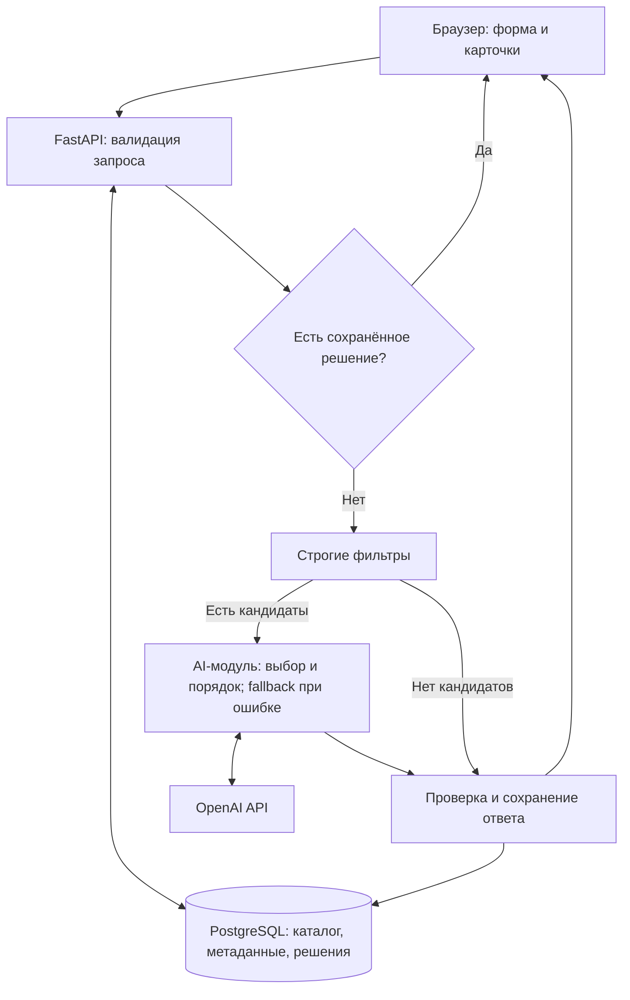

# pop-Eyes — AI-подбор подрядчиков для мероприятий

Проект команды **pop-Eyes Team** для хакатона **HackAlem AI**.

pop-Eyes помогает организаторам мероприятий и корпоративным заказчикам выбрать подрядчиков из каталога. Вместо ручного сравнения десятков описаний пользователь задаёт условия и пожелания, а сервис возвращает до трёх подходящих вариантов с короткими объяснениями.

**Код проверяет обязательные ограничения, ИИ сравнивает контекст и выбирает лучших из всех допустимых кандидатов.** Имена, цены и остальные данные карточек берутся из PostgreSQL.

## Что реализовано

- Форма заказа: город, дата, формат мероприятия, категория, бюджет; необязательные язык, длительность и пожелания.
- Каталог из **66 профилей и 17 категорий**, загруженный из предоставленного CSV в PostgreSQL.
- Строгая проверка города, категории, занятости, начальной цены, формата, языка и длительности. Ограничения автоматически не ослабляются.
- AI-выбор и упорядочивание до трёх подрядчиков с учётом пожеланий, опыта и особенностей профилей.
- AI-объяснения до **280 символов**: проверенная дата и одна-две цитаты из профиля. Когда код распознаёт сведения о конкретном опыте, масштабе или услугах, цитаты выбираются из них. API возвращает идентификаторы подтверждающих фактов — `evidence_ids`.
- Сохранение решений в БД: одинаковый запрос при неизменных версиях данных и алгоритма получает те же карточки и порядок, в том числе после перезапуска.
- Резервный подбор при недоступности AI с явной меткой «Резервный подбор · без AI».
- Различимые пустые результаты, причины исключения кандидатов и ошибки ввода.
- Метки синтетических профилей, подставленных городов и цен.
- Шесть готовых запросов для демонстрации, Swagger UI, автоматические тесты и запуск приложения с БД через Docker Compose.

## Как работает решение

1. Пользователь заполняет форму или выбирает готовый запрос и нажимает **«Подобрать подрядчиков»**.
2. Backend получает каталог из БД и проверяет значения справочников, типы и границы календаря. При наличии сохранённого решения возвращает его.
3. Для нового запроса код находит нужные город и категорию, затем исключает занятых и не подходящих по бюджету, формату, длительности и языку.
4. AI получает **всех** оставшихся кандидатов и пожелания. Предварительного сокращения списка до трёх нет. Модель выбирает состав и порядок рекомендаций, а также факты для объяснений.
5. Backend проверяет выбранные ID, количество, уникальность и ссылки на факты. Формирует карточки из БД и сохраняет результат до отправки пользователю.
6. Frontend показывает карточки в полученном порядке, объяснения, режим подбора и сводку исключений.

| Результат | Что видит пользователь |
| --- | --- |
| `matched` | От одного до трёх подрядчиков: ровно `min(3, eligible_count)` |
| `category_absent` | В выбранном городе нет такой категории |
| `no_matches` | Категория есть, но обязательные условия никто не прошёл |

Для пустых результатов `cards: []`, `selection_mode: null`; AI не вызывается. Каждый исключённый кандидат учитывается в одной причине в порядке: дата → бюджет → формат → длительность → язык.

### Повторяемость и резервный режим

Повторяемость обеспечивает **сохранение решения в PostgreSQL**, а не обещание одинаковых независимых ответов модели. Ключ включает весь нормализованный запрос, в том числе пожелания, дату, язык и длительность, версию каталога и версию алгоритма с настройками AI. Пробелы по краям строк удаляются; перефразированные пожелания считаются другим запросом.

При одновременных одинаковых запросах используется первый сохранённый результат. Повтор возвращает `cache_hit=true`; карточки, объяснения и порядок сохраняются. Экспортируемая модулем `RECOMMENDATION_VERSION` автоматически участвует в ключе, а `AI_VERSION` служит дополнительной ручной меткой.

Если сохранённого ответа нет, а AI отключён, недоступен, не уложился в таймаут или вернул неверный результат, fallback выбирает кандидатов по начальной цене, затем по ID. **Пожелания в fallback не оцениваются.** Такой ответ тоже сохраняется и не заменяется AI-ответом внутри той же версии. Для нового расчёта можно изменить `AI_VERSION` и пересоздать приложение.

## Технологии

| Компонент | Технологии |
| --- | --- |
| Интерфейс | HTML5, CSS3, JavaScript, Fetch API; без отдельного frontend-сервера |
| Backend | Python 3.12, FastAPI 0.141.1, Pydantic, Uvicorn 0.53.0 |
| База данных | PostgreSQL 16, SQL, Psycopg 3.3.6 |
| AI | OpenAI Responses API, модель `gpt-4o-mini` по умолчанию, OpenAI Python SDK 2.54.0 |
| Формат ответа модели | Structured Outputs с JSON Schema и повторная проверка кодом |
| Инфраструктура | Docker, Docker Compose, именованный том PostgreSQL |
| Проверки | Python `unittest`, `unittest.mock`, HTTP-проверки, сценарии на реальном каталоге |

Модель задаётся через `OPENAI_MODEL`. Текущая версия AI-модуля: `ranking-v7:evidence-v3:fallback-v2`. Зависимости закреплены в [requirements.txt](requirements.txt) и [requirements-ai.txt](requirements-ai.txt).

## Архитектура



Compose запускает два сервиса: `app` и `db`. FastAPI отдаёт и статические файлы, и API на одном адресе. PostgreSQL доступен внутри Docker-сети как `db:5432`; отдельный порт БД на компьютере не публикуется. API-ключ находится только на сервере.

```text
frontend/                 HTML, CSS и JavaScript интерфейса
app/
  main.py                 HTTP-маршруты, ошибки, статические файлы
  catalog.py, db.py        Чтение каталога и соединение с PostgreSQL
  recommendations.py      Фильтры, ключ запроса, сохранение результатов
  ranking.py              Подключение AI, проверка ответа и fallback
  schemas.py              Модели запросов и ответов
ai_module/                Подготовка фактов, вызов модели, объяснения, оценка
db/init/                  SQL-схема, импорт CSV и таблица результатов
tests/                    Тесты и девять сценариев AI на реальных профилях
scripts/                  Воспроизведение тестовых данных из CSV
docs/                     Контракты, аудит данных, отчёты AI и план
compose.yaml, Dockerfile  Окружение приложения и БД
```

## Установка и запуск

### 1. Подготовить окружение

Нужны **Git**, **Docker** и **Docker Compose v2** с поддержкой `--wait`. В Windows используйте запущенный Docker Desktop в режиме Linux containers. Python, Node.js и PostgreSQL отдельно устанавливать не требуется.

При первой сборке нужен интернет для загрузки образов и зависимостей. Для AI-режима дополнительно нужны доступ к OpenAI API и собственный API-ключ с доступом к выбранной модели; вызовы API оплачиваются отдельно.

```console
git clone https://github.com/BAITC-Hacks/hack-5e4631a9-pop-eyes-team.git
cd hack-5e4631a9-pop-eyes-team
```

### 2. Создать настройки

В Windows PowerShell:

```powershell
Copy-Item .env.example .env
```

В Linux/macOS:

```bash
cp .env.example .env
```

Копируйте файл только при первом запуске: существующий `.env` содержит ваши настройки. Задайте в нём собственный `POSTGRES_PASSWORD` вместо `replace_with_local_password`.

| Переменная | Назначение |
| --- | --- |
| `APP_PORT` | Порт приложения на компьютере, по умолчанию `8000` |
| `POSTGRES_DB`, `POSTGRES_USER` | Имя БД и пользователь, по умолчанию `eventmatch` |
| `POSTGRES_PASSWORD` | Обязательный пароль локальной БД |
| `AI_MODULE` | `ai_module` для подключения AI; пустое значение включает backend fallback |
| `AI_MODE` | `auto` для AI с резервным режимом; `fallback` для принудительного резервного подбора |
| `OPENAI_API_KEY` | Серверный ключ для вызова модели; в Git не добавляется |
| `OPENAI_MODEL` | По умолчанию `gpt-4o-mini` |
| `AI_TIMEOUT_SECONDS` | В Compose по умолчанию `8` секунд, допустимое значение `(0, 30]` |
| `AI_VERSION` | Дополнительная ручная версия для разделения сохранённых решений |

**Для основной демонстрации с AI** установите:

```dotenv
AI_MODULE=ai_module
AI_MODE=auto
AI_VERSION=ranking-v7:evidence-v3:fallback-v2
AI_TIMEOUT_SECONDS=8
OPENAI_MODEL=gpt-4o-mini
OPENAI_API_KEY=your_openai_api_key
```

Замените `your_openai_api_key` своим ключом. **Для запуска без внешних вызовов** оставьте `AI_MODULE` и `OPENAI_API_KEY` пустыми либо задайте `AI_MODE=fallback`. Фильтры, БД, интерфейс и сохранение результатов будут работать; оценка пожеланий моделью требует AI-режима.

### 3. Запустить

Из корня репозитория:

```console
docker compose up --build -d --wait
docker compose ps
```

На пустом томе SQL-скрипты автоматически создадут таблицы и импортируют 66 профилей. У `app` и `db` ожидается состояние `healthy`.

Откройте [приложение](http://localhost:8000/) или [Swagger UI](http://localhost:8000/docs). Страница [health](http://localhost:8000/health) должна вернуть `status: "ok"`, `database: "ok"` и `profiles_count: 66`.

Адреса приведены для `APP_PORT=8000`. Если порт занят, измените его в `.env`. Интерфейс нужно открывать через сервер, а не как локальный HTML-файл. Приложение доступно только на локальном компьютере через `127.0.0.1`.

### Обновление, перезапуск и существующая БД

После изменения кода или `.env`:

```console
docker compose up --build -d --wait
```

Обычный `docker compose restart app` перезапускает процесс, но не применяет новые переменные окружения из `.env`.

Если БД создана старой версией проекта без таблицы рекомендаций, перед запуском обновлённого приложения выполните:

```console
docker compose up -d --wait db
docker compose exec -T db psql -U eventmatch -d eventmatch -v ON_ERROR_STOP=1 -f /docker-entrypoint-initdb.d/003_recommendations.sql
docker compose up --build -d --wait
```

Скрипт допускает повторное выполнение и сохраняет профили. Если вы изменили пользователя или имя БД, замените `eventmatch` своими значениями. Смена пароля в `.env` после создания БД сама по себе не меняет пароль уже существующего пользователя PostgreSQL.

Полезные команды:

```console
docker compose logs --tail=50 app db
docker compose restart app
docker compose down
docker compose up -d --wait
```

Команды `down` и `restart` сохраняют данные в томе `pop-eyes_postgres_data`. Удаление тома, в том числе через `down --volumes`, удаляет каталог и сохранённые рекомендации.

## Как проверить решение: сценарии для жюри

### Основной сценарий

1. Включите AI по инструкции выше и откройте приложение.
2. Нажмите **«Деловой вечер»**, затем **«Подобрать подрядчиков»**.
3. Ожидайте `matched`, метку **«AI-подбор»**, четыре допустимых кандидата и три карточки с датой и цитатами. Если показан резервный режим, фильтры сработали, но успешный AI-вызов этим запросом не подтверждён.
4. Повторите запрос: состав, порядок и объяснения должны совпасть.
5. Выполните `docker compose restart app`, дождитесь готовности и повторите тот же запрос. Сохранённый результат должен остаться прежним.
6. Выберите **«Неформальный вечер»**. Обязательные условия останутся теми же, изменятся пожелания. Оцените релевантность выбранных фактов; это отдельный ключ запроса. ИИ не обязан менять тройку, если те же подрядчики подходят обоим контекстам.

### Контрольные случаи

Во всех строках формат — **корпоратив**, язык и длительность не заданы.

| Кнопка / сценарий | Условия | Ожидаемый результат |
| --- | --- | --- |
| Деловой / неформальный вечер | Алматы, Ведущий, 10.10.2026, 1 000 000 ₸ | 4 допустимых кандидата, 3 карточки |
| Дата в декабре | Алматы, Ведущий, 19.12.2026, 1 000 000 ₸ | 1 карточка: Кики; остальные 9 заняты |
| Редкая категория | Алматы, Флорист, 10.10.2026, 500 000 ₸ | 1 карточка: Тони Тони Чоппер |
| Малый бюджет | Алматы, Ведущий, 10.10.2026, 10 000 ₸ | `no_matches`, без карточек |
| Нет категории в городе | Астана, Декоратор, 10.10.2026, 1 000 000 ₸ | `category_absent`, без карточек |
| Площадка, заполнить вручную | Алматы, Банкетный зал, 14.11.2026, 6 000 000 ₸ | 2 допустимых кандидата, 2 карточки |
| Дата вне календаря, через Swagger | Дата `2027-01-01`, остальные поля как в основном запросе | HTTP 422 |

Кнопки только заполняют форму; результат рассчитывает сервер по данным БД. Конкретная AI-тройка не зашита в frontend.

### Проверка через API

В [Swagger UI](http://localhost:8000/docs) откройте `POST /api/recommendations` → **Try it out**, вставьте JSON и нажмите **Execute**:

```json
{
  "city": "Алматы",
  "date": "2026-10-10",
  "event_type": "корпоратив",
  "category": "Ведущий",
  "budget_kzt": 1000000,
  "duration_hours": null,
  "language": null,
  "preferences": "Деловой корпоратив: в первую очередь опыт деловых мероприятий и интеллигентный юмор. Без навязчивых конкурсов."
}
```

Проверьте `status`, `selection_mode`, `eligible_count`, `cards` и `cache_hit`. После повтора `cache_hit` должен быть `true`; если запрос уже выполнялся через форму, он может быть `true` сразу.

| Маршрут | Назначение |
| --- | --- |
| `GET /` | Интерфейс и статические файлы |
| `GET /health` | Готовность БД, число профилей и версия каталога |
| `GET /api/options` | Города, категории, форматы, языки, `date_min` и `date_max` |
| `POST /api/recommendations` | Подбор и сохранённый результат |
| `GET /api/contractors/{id}` | Полный профиль из БД |
| `GET /docs` | Интерактивная документация API |

Неверные параметры возвращают HTTP 422, неизвестный ID профиля — 404, недоступная БД — 503. Поля карточек и ответы подробно описаны в [API_CONTRACT.md](docs/API_CONTRACT.md).

## Автоматические проверки

После запуска контейнеров AI-модуль и его контракт с backend можно проверить **без внешних вызовов**:

```console
docker compose exec -T app python -m unittest discover -s tests -p "test_ai*.py" -v
docker compose exec -T app python scripts/build_ai_fixtures.py --check
docker compose exec -T app python -m ai_module.evaluate
```

В тестах ответы провайдера подменяются, а `evaluate` без `--live` проверяет fallback на девяти сценариях. Это не проверка качества нового ответа внешней модели.

**Полный набор** также обращается к работающему HTTP-серверу и реальной БД. Чтобы выполнить его без платных AI-вызовов, временно задайте `AI_MODE=fallback` в `.env`, примените настройки и запустите:

```console
docker compose up -d --wait app
docker compose exec -T app python -m unittest discover -s tests -v
```

После проверки верните `AI_MODE=auto` и снова выполните `docker compose up -d --wait app`. Проверки охватывают сохранность всех полей CSV, фильтры, редкие и пустые результаты, HTTP-контракт, ошибки, ссылки на факты и конкурентное сохранение.

Для отдельной проверки настоящего AI на том же деловом сценарии:

```console
docker compose exec -T app python -m ai_module.evaluate --live --cases hosts_business
```

Нужен настроенный ключ; команда отправляет тестовые пожелания и четыре обезличенных профиля в OpenAI и выполняет платный API-вызов. `--live` без `--cases` запускает все девять сценариев, семь из которых требуют AI.

### Уже выполненные проверки

На текущей версии `ranking-v7:evidence-v3:fallback-v2`:

- **52 локальных AI-теста** проходят, включая совместимость с адаптером backend и проверки конкретности цитат.
- Семь непустых сценариев получили реальные AI-ответы без ошибок проверок; два пустых сценария обошлись без сети.
- Время вызова модуля — **1,52–5,70 с**, длины объяснений — **77–225 символов**. Весь профиль остаётся доступен AI для выбора; отдельная рубрика проверяет конкретность показанных фактов.
- Это проверка AI-модуля, не измерение полного HTTP-сценария с БД. [Результаты и ограничения](docs/AI_EVALUATION.md), [инструкция AI](docs/AI_MODULE.md).

Ранее, на версии `ranking-v6:evidence-v3:fallback-v2`, 23.09.2026:

- 54 выбранных теста AI, интеграционного контракта, фильтров и импорта прошли; пять HTTP-тестов полного набора в этот прогон не входили.
- Реальный запрос через backend выбрал три карточки из четырёх за **4,42 с**; длины объяснений — **245, 178 и 238 символов**.
- Повтор из БД занял **0,027 с**. После перезапуска приложения с той же БД карточки, объяснения и порядок совпали.
- Отдельные измерения AI-модуля на семи непустых сценариях и проверка качества цитат сохранены в [AI_EVALUATION.md](docs/AI_EVALUATION.md).

Это результаты отдельных локальных прогонов, а не гарантия задержки под нагрузкой. Проверка запуска из свежего клона остаётся отдельным этапом приёмки.

## Данные и интеграции

Источник — предоставленный для хакатона [hackathon dataset anonymized .csv](hackathon%20dataset%20anonymized%20.csv): **66 профилей, 13 полей, 17 категорий**. Распределение: Алматы — 50 профилей, Астана — 15, «Зарубежье» — 1. HTML-превью приложению не требуется.

При первом создании пустой БД выполняются:

| Скрипт | Назначение |
| --- | --- |
| `001_schema.sql` | Таблицы `contractors` и `dataset_metadata` |
| `002_seed.sql` | Импорт CSV через PostgreSQL `COPY`, типизация, обновление по ID, контрольные суммы |
| `003_recommendations.sql` | Таблица `recommendation_results` для сохранения ответов |

Сохраняются все исходные поля: `id`, `anon_name`, `categories`, `city`, `city_imputed`, `synthetic`, `price_from_kzt`, `price_imputed`, `event_formats`, `languages`, `max_hours`, `busy_dates`, `description`. Списки преобразуются в массивы, даты, числа и флаги — в соответствующие типы.

Обычный перезапуск **не импортирует CSV повторно**: запросы читают PostgreSQL. Для обновления каталога после изменения CSV:

```console
docker compose exec -T db psql -U eventmatch -d eventmatch -v ON_ERROR_STOP=1 -f /docker-entrypoint-initdb.d/002_seed.sql
```

Импорт атомарен: существующие ID обновляются, новые добавляются без дубликатов. Исчезнувшие из CSV записи автоматически не удаляются. Версия вычисляется по нормализованному каталогу; изменение данных отделяет новые рекомендации от старого кэша.

**Внешняя интеграция — OpenAI API.** Сервер передаёт параметры заказа, пожелания и факты всех допустимых профилей. Полные календари занятости не отправляются: дату проверяет backend. Полный текст описаний сохраняется в наборе фрагментов. Вызов настроен с `store=False`; приложение само хранит запрос и результат в своей БД. `.env` исключён из Git и контекста Docker-сборки.

Подробный состав и правила интерпретации данных: [DATA_AUDIT.md](docs/DATA_AUDIT.md).

## Ограничения текущей версии

- Доступность известна только с **23.09.2026 по 31.12.2026 включительно**. Даты вне этого окна отклоняются; свободная дата в каталоге не означает бронирование.
- Цена «от» — начальная стоимость за мероприятие, а не итоговая смета. `max_hours=null` означает неприменимость ограничения присутствия, а не ноль часов.
- В датасете есть **13 синтетических профилей, 8 подставленных городов и 18 подставленных цен**; признаки отображаются в карточках.
- Пожелания — мягкие предпочтения. Проверка цитаты подтверждает её источник, но не доказывает выполнение каждого пожелания или объективно лучший выбор. Неподтверждённые вместимость, парковка и другие свойства не становятся строгими фильтрами.
- AI зависит от сети, доступа к модели и лимитов API. При сбое доступен fallback, который не оценивает контекст.
- Повторяемость гарантируется в пределах сохранённой БД, запроса и версий. После удаления тома или смены версии новый AI-вызов может дать другой порядок.
- Нет бронирования, оплаты, связи с подрядчиками, личных кабинетов, авторизации и административного интерфейса.
- Нет синхронизации с внешними CRM и календарями, подсказок альтернативных дат, поиска с эмбеддингами и подробного сравнения карточек.
- Решение рассчитано на хакатонный каталог; нагрузочная проверка и подготовка публичного production-развёртывания не выполнены.

## Развёрнутая версия

**Публичная deployed-версия не подготовлена.** Для демонстрации запустите проект по инструкции и откройте [http://localhost:8000/](http://localhost:8000/). Это локальный адрес, доступный после запуска на вашем компьютере.

## Документация

- [Контракт API и AI-модуля](docs/API_CONTRACT.md)
- [Устройство и проверка AI-модуля](docs/AI_MODULE.md)
- [Отчёт об оценке AI](docs/AI_EVALUATION.md)
- [Аудит исходных данных](docs/DATA_AUDIT.md)
- [План хакатона и критерии готовности](docs/HACKATHON_PLAN.md)
