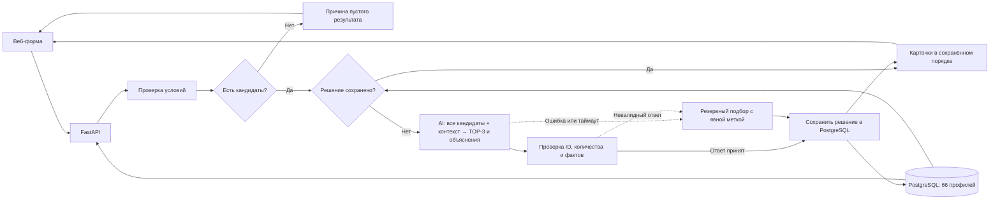

# HackAlem AI: план разработки MVP за 5 часов

**Команда:** pop-Eyes Team, 3 участника.

**Кейс:** умный подбор подрядчиков (#79-lite).

**Дата подготовки:** 23 сентября 2026 года.

**Рекомендация: FastAPI + PostgreSQL + простой веб-интерфейс, запускаемый через Docker Compose.** Код проверяет обязательные ограничения. AI сравнивает всех прошедших кандидатов по контексту заказа, выбирает до трёх лучших, определяет их порядок и объясняет выбор. Основной сценарий должен работать к концу второго часа.

**Уточнение команды:** AI отвечает именно за выбор подрядчиков. Сортировка по цене используется только в явно обозначенном резервном режиме при недоступности AI.

План основан на предоставленных ТЗ, CSV и HTML-превью. Требования кейса рассматриваются как исходные материалы; распределение работы и приоритеты реализации — решения команды для пятичасового хакатона.

Ниже сохранён план пятичасовой работы: результаты часов — цели, а не утверждение о выполнении всех пунктов. Тексты отчётов организаторам использовать только после достижения соответствующего checkpoint.

### Текущее состояние и уточнение ролей — 23.09.2026

- Участник 1 реализовал SQL-импорт 66 профилей, инфраструктуру, `/health`, `/api/options`, чтение профиля, `POST /api/recommendations`, строгие фильтры и сохранение решений. Эти изменения получены из `main` (`bd6b266`).
- **CSV импортирует участник 1. Участнику 2 производственный парсер не нужен.** Согласован вызов `async def rank_candidates(request, eligible_candidates) -> dict`, возвращающий `selection_mode` и `selected` с полями `id`, `reason`, `evidence_ids`. Backend сохраняет порядок AI.
- Участник 2 подготовил модуль, общую `build_evidence`, поддержку SQL `Decimal`, fallback, таймаут и девять сценариев на реальных профилях. Инструкция подключения — [AI_MODULE.md](AI_MODULE.md), измерения и границы проверки — [AI_EVALUATION.md](AI_EVALUATION.md).
- Интерфейс обращается к настоящему API; backend преобразует `anon_name` в `name` карточки, справочники берутся из БД.
- По отчёту команды полный сценарий с AI и повтором из PostgreSQL уже проверен: 47 тестов, 6,31 с для AI-запроса и 0,024 с для повтора. Это результаты стенда команды до текущей доработки объяснений, не новый локальный замер.
- Доработка участника 2: объяснения до 280 символов, два предложения — проверенная дата и цитаты; версия `ranking-v6:evidence-v3:fallback-v2` автоматически входит в ключ кэша. [Актуальный AI-отчёт](AI_EVALUATION.md).
- Следующий общий checkpoint: после обновления повторить AI-запрос и проверить сохранение его карточек после перезапуска. Запуск из свежего клона с пустой БД и финальное demo остаются отдельными проверками. Локальные AI-тесты их не заменяют.

## 1. Краткое понимание задачи

Нужно помочь заказчику **выбрать подрядчика из существующего каталога**: принять условия мероприятия и вернуть **не более трёх подходящих карточек с содержательными объяснениями**.

Полный сценарий:

**Параметры мероприятия и пожелания → строгие фильтры кодом → все допустимые кандидаты → AI-оценка контекста и выбор TOP-3 → проверка и сохранение решения → карточки с объяснениями.** Если фильтры не оставили кандидатов, backend сразу возвращает понятную причину без вызова AI.

По фактическому CSV:

| Что проверено | Результат |
| --- | --- |
| Профили | 66, все ID уникальны |
| География | Алматы — 50, Астана — 15, «Зарубежье» — 1 |
| Категории | 17; у профиля может быть несколько |
| Синтетические профили | 13 |
| Подставленные значения | Город — у 8 профилей, цена — у 18 |
| Календарное окно | 23.09.2026–31.12.2026 |
| `max_hours` отсутствует | У флористов, декораторов, подарков/сувениров |

Критические особенности:

- `price_from_kzt` — **начальная цена**, нельзя обещать окончательную стоимость.
- `max_hours=null` означает неприменимость ограничения присутствия, а не ноль часов.
- За пределами календарного окна доступность неизвестна.
- Занятость площадок проверяется так же, как занятость ведущих и фотографов.
- В декабре мало свободных кандидатов — это ожидаемый результат.

## 2. Что жюри будет оценивать

В ТЗ указаны следующие критерии:

| Критерий | Баллы | Чем подтверждаем |
| --- | ---: | --- |
| Соответствие задаче и работоспособность | 25 | Полный сценарий, ограничения, три различимых исхода |
| Техническая реализация | 25 | Понятный алгоритм, работающая интеграция AI, устойчивость |
| README и воспроизводимость | 25 | Запуск с нуля, Docker, данные, инструкция проверки |
| Ценность и применимость | 15 | Объяснения помогают выбрать между кандидатами |
| Потенциал развития и оригинальность | 10 | Обоснованные улучшения и прозрачность рекомендаций |
| **Итого** | **100** | |

**Приоритет из ТЗ: объяснения → честная обработка редких, занятых и пустых категорий → скорость → интерфейс.**

Вероятные проверки жюри:

1. Повторить запрос и сравнить порядок карточек.
2. Изменить дату и проверить занятость.
3. Выбрать редкую категорию.
4. Указать слишком маленький бюджет.
5. Запросить категорию, которой нет в выбранном городе.
6. Сравнить объяснения: отличаются ли они содержательно после удаления имён.
7. Запустить проект по README.

## 3. P0 / P1 / P2

### P0 — обязательно для сдачи

- Форма: город, дата, формат мероприятия, категория, бюджет; язык и длительность необязательны для заполнения.
- Поле «Пожелания к подрядчику / контекст мероприятия»: необязательно для заполнения, но входит в MVP команды, чтобы AI могла учитывать стиль, аудиторию и особенности заказа.
- Правильная загрузка предоставленного датасета.
- Проверка города, категории, даты, бюджета, формата и заданных дополнительных условий.
- Занятые подрядчики никогда не попадают в рекомендации.
- До трёх карточек: имя, категория, город, цена «от», 1–2 конкретных предложения.
- AI выбирает и упорядочивает до трёх подрядчиков из всех прошедших фильтры; backend не сокращает этот список до TOP-3 заранее.
- Одинаковый запрос на одной версии данных и алгоритма даёт сохранённый порядок. Проверенное решение сохраняется в PostgreSQL до выдачи пользователю и переживает перезапуск приложения.
- Три понятных исхода:
  - `matched` — подобрали;
  - `category_absent` — в этом городе нет такой категории;
  - `no_matches` — категория есть, но условия никто не проходит.
- Если найдено меньше трёх — показать фактическое количество и причину.
- Понятные ошибки ввода; даты вне известного календаря не считаются свободными.
- Рабочий резервный подбор и объяснения при недоступности AI; интерфейс явно показывает, что результат получен без AI.
- Проверка трёх обязательных демонстрационных сценариев из ТЗ.
- README, GitHub, отсутствие секретов.

**Дополнительные P0 нашей команды:** запуск приложения вместе с БД через Compose, поле пожеланий, постоянное хранение решений и демонстрация настоящего AI-выбора из более чем трёх допустимых кандидатов. Само ТЗ не предписывает конкретного провайдера.

### P1 — существенно повышает качество

- Отличительные факты из описания каждого подрядчика.
- Метки синтетических профилей и подставленных значений.
- Сводка причин исключения кандидатов.
- Сравнение качества AI-выбора на нескольких контекстах одного мероприятия.
- Автоматические проверки бизнес-правил.
- Кнопки готовых демонстрационных запросов.
- Измерение времени ответа.

### P2 — только после стабильных P0 и P1

- Подсказка ближайшей подходящей даты.
- Поиск с эмбеддингами при дальнейшем росте каталога; для 66 профилей он не нужен.
- Более подробное сравнение кандидатов.
- Публичный deployment.
- Дополнительные синтетические профили с явной маркировкой.

Отдельного списка обязательных bonus-функций в ТЗ нет — это наши варианты развития.

**В пять часов не закладываем:** бронирование, оплату, кабинеты, уведомления, обучение модели, сложную агентную систему и отдельную векторную БД.

## 4. Архитектура MVP



### Технологии

| Компонент | Решение |
| --- | --- |
| Интерфейс | HTML/CSS/JavaScript, одна страница |
| Backend | Python, FastAPI, Pydantic |
| База | PostgreSQL: профили и сохранённые решения по запросам |
| Импорт | SQL `COPY` и нормализация PostgreSQL, участник 1 |
| AI | OpenAI API, модель через `OPENAI_MODEL` |
| Проверки | `unittest`: AI отдельно, БД/HTTP в Compose |
| Запуск | Docker Compose: `app` и `db` |

FastAPI может отдавать статические файлы интерфейса, поэтому отдельный frontend-сервер для такого MVP не нужен. [Документация FastAPI](https://fastapi.tiangolo.com/tutorial/static-files/)

### Бизнес-логика

1. Проверить ввод.
2. Найти профили по **городу + категории**.
3. Если их нет — вернуть `category_absent`.
4. Исключить занятых и не проходящих остальные условия.
5. Если никого не осталось — вернуть `no_matches`.
6. Найти сохранённое решение для полного запроса и текущих версий данных, модели и prompt; если оно есть, вернуть его.
7. Передать AI **всех** прошедших кандидатов с описаниями, параметрами заказа и пожеланиями. Сортировать вход по `id` только для постоянного порядка передачи, не для выбора победителей.
8. Получить от AI упорядоченный список из `min(3, eligible_count)` подрядчиков, объяснения и ссылки на факты.
9. Проверить ответ, сохранить принятое решение и показать карточки в порядке AI. При ошибке применить явно обозначенный fallback.

**Пример потока:** 66 профилей → 10 прошли фильтры → AI сравнила эти 10 и выбрала 3. Число 10 здесь иллюстративное, а не лимит: если прошли 4, передаём 4; если 15 — все 15. Нельзя заранее оставить только дешёвых кандидатов и выдавать это за AI-выбор.

**Жёсткие ограничения** задаются структурированными полями формы. **Мягкие предпочтения** — стиль, аудитория, атмосфера, подход к работе — передаются AI через `preferences`. Пожелания не разрешают превышать бюджет или рекомендовать занятых. При противоречии приоритет у структурированных полей; недостающие сведения не считаются подтверждённым совпадением.

Счётчики исключений считаем последовательно: **дата → бюджет → формат → длительность → язык**. Один профиль учитывается один раз, поэтому суммы не вводят пользователя в заблуждение.

### Что делает AI

Для первого прототипа используем `gpt-4o-mini`, если модель доступна командному аккаунту. Конкретную модель подтверждаем реальным запросом в первый час.

Задача AI — сравнить кандидатов и вернуть готовый порядок рекомендаций. Критерии в prompt:

1. Соответствие явно указанным пожеланиям и контексту мероприятия.
2. Подтверждённый описанием релевантный опыт и особенности работы.
3. Конкретные преимущества и ограничения относительно других допустимых кандидатов.
4. При сопоставимой релевантности — меньшая начальная цена; при полном равенстве — `id`.

Если пожелания пусты, AI опирается на формат мероприятия и подтверждённый профильный опыт. Не придумывает аудиторию, стиль заказчика, рейтинг, отзывы или свойства подрядчика. Числовой «процент соответствия» для MVP не нужен.

Реализация:

- Разбить полные описания на фрагменты с идентификаторами, сохранив весь содержательный текст.
- Передать параметры заказа, пожелания и все допустимые профили, включая цены, структурированные признаки и описания. Полные календари занятости передавать не нужно: дату уже проверил backend.
- Одним запросом попросить сравнить всех кандидатов и выбрать ID и ссылки на факты в порядке важности. AI-модуль собирает `reason` до 280 символов: проверенная backend дата и короткие цитаты. Возвращается согласованный `selected` с `id`, `reason`, `evidence_ids`; backend не зависит от внутреннего формата модели.
- Проверить, что ID входят в допустимый список, не повторяются, количество равно `min(3, eligible_count)`, а ссылки на факты принадлежат соответствующим профилям. Условия допуска повторно проверяет код.
- Имена, цены, город и прочие поля карточки брать из БД, а не из текста модели. Объяснения цитируют факты профиля. Неподтверждённые пожелания нельзя показывать как выполненные; автоматические метки полного/частичного совпадения не используются.
- Описания и пожелания передаются модели как данные, а не инструкции, способные изменить правила отбора. Они не могут отменить ограничения или добавить новый ID.

**AI определяет состав и порядок TOP-3. Backend проверяет допустимость и сохраняет решение, не пересортировывая его по цене.** Structured Outputs помогает соблюдать формат ответа, но не гарантирует правдивость текста: проверка ссылок подтверждает источник, а смысл объяснений дополнительно оцениваем на тестовых запросах. [OpenAI Docs](https://developers.openai.com/api/docs/guides/structured-outputs)

Пример объяснения на основе реального профиля:

> На 10 октября свободен по календарю, работает на корпоративах; цена от 500 000 ₸ при бюджете 1 000 000 ₸. В описании указана специализация на корпоративных мероприятиях и деловых встречах.

Для другого кандидата отличительным фактом может быть акцент на развлечениях и танцах без длинных речей.

Например, пожелание «деловой корпоратив, интеллигентный юмор, без длинных речей» позволяет AI сопоставить особенности профилей с задачей. Более дешёвый кандидат не обязан занимать первое место. Это пример входного контекста, а не заранее объявленный результат модели.

**Ограничение времени:** один AI-запрос на всех прошедших фильтры кандидатов, общий таймаут 8 секунд, без повторных попыток SDK. Для пустого результата AI вообще не нужен. Замер модуля есть в [AI_EVALUATION.md](AI_EVALUATION.md); ориентир до 10 секунд для полного HTTP-сценария проверяем отдельно после интеграции.

**Fallback:** если сохранённого решения нет, а AI недоступна или ответ не прошёл проверку, выбрать до трёх допустимых кандидатов по `price_from_kzt ASC, id ASC` и сформировать объяснения по шаблону. Показать сообщение «AI-подбор временно недоступен; показаны подходящие варианты по начальной цене». Это аварийный режим, а не замена обязательной демонстрации AI-выбора.

### Повторяемость AI-выбора

Для одного запроса AI может дать разные результаты при независимых вызовах; повторяемость обеспечивает приложение, а не обещание в prompt. [OpenAI Docs: недетерминированность моделей](https://developers.openai.com/api/docs/guides/model-optimization)

- Нормализовать структурированные поля и пробелы по краям пожеланий, сохраняя смысл текста. Включить в ключ все поля запроса, в том числе дату и `preferences`, версию датасета, модель, версию prompt и правил отбора.
- В таблице `recommendation_results` хранить уникальный `request_key`, упорядоченные ID, объяснения, ссылки на факты, `selection_mode` и версии. PostgreSQL сохраняет их в именованном томе.
- Сначала искать запись; при её отсутствии вызвать AI. Первое принятое решение сохранить атомарно **до** ответа пользователю. При одновременных запросах уникальность ключа и чтение сохранённой записи должны вернуть обоим клиентам один результат.
- Сохранять и резервное решение с `selection_mode=fallback`; не заменять его молча после восстановления API. Повторный расчёт выполняется явно при смене версии рекомендаций и не считается повтором в той же версии.
- Сохранённое AI-решение остаётся доступным при отключённом API. Перезапуск контейнера с тем же томом не меняет порядок.

**Граница гарантии:** после удаления БД/тома сохранённого решения больше нет; новый независимый AI-вызов может выбрать другую тройку. README должен объяснять эту границу. В тестах отдельно проверяем первый AI-выбор, повтор запроса и перезапуск с сохранённой БД; не заявляем воспроизводимость первого вызова на двух пустых БД.

NVIDIA API подключаем только при уже проверенном доступе и необходимости замены провайдера. Две интеграции одновременно не планируем.

### Docker и база

- `app`: API и веб-интерфейс.
- `db`: PostgreSQL с именованным томом для профилей и результатов AI-отбора.
- Автоматический импорт 66 профилей без дубликатов при повторном запуске.
- Проверка готовности БД перед запуском приложения.
- Секреты передаются через окружение.

В Compose для ожидания готовности БД нужен `healthcheck` и зависимость `service_healthy`. [Документация Docker](https://docs.docker.com/compose/how-tos/startup-order/)

**Целевой запуск после реализации:**

```powershell
Copy-Item .env.example .env
# Задать локальный пароль БД; при необходимости добавить API-ключ.
docker compose up --build
```

На момент подготовки плана проверка в текущем окружении не смогла подключиться к Docker Engine. Его работоспособность нужно подтвердить в начале первого часа.

## 5. Распределение ролей

| Участник | Ответственность | Владение файлами |
| --- | --- | --- |
| **1 — Backend / Integration** | API, БД и SQL-импорт, строгие фильтры, проверка и сохранение решений, Docker, финальная интеграция | Backend, схемы API, зависимости, Compose |
| **2 — AI / Data** | AI-ранжирование, выбор TOP-3, общие факты, объяснения, таймаут, fallback и оценка качества | AI-модуль, `requirements-ai.txt`, тестовые данные и проверки выбора |
| **3 — Frontend / Demo** | Форма с пожеланиями, карточки, метки режима, demo, README | Статический интерфейс и документация |

**Участник 1 — единственный ответственный за финальную интеграцию.** Изменения общего API и зависимостей согласуются через него.

## 6. План на 5 часов

Первые четыре часа: примерно **45 минут разработки, 10 минут интеграции и проверки, 5 минут отчёта**. Интегрировать можно и раньше.

### Час 1 — Foundation

Первые 10 минут вместе: утвердить API, структуру проекта, строгие фильтры, критерии AI-выбора, формат пожеланий и владельцев файлов.

| Участник | Задача | Результат |
| --- | --- | --- |
| 1 | FastAPI, `/health`, схемы API, Compose с PostgreSQL, минимальный импорт | Приложение и БД запускаются; API читает реальные профили |
| 2 | Принять нормализованный контракт от backend; передать AI более трёх реальных допустимых кандидатов и контекст, получить TOP-3 с фактами; подготовить fallback | Работающий прототип AI-выбора и объяснений, замер задержки |
| 3 | Форма с пожеланиями, карточки, три бизнес-состояния и метка fallback по согласованному JSON; каркас README | Интерфейс открывается и готов к подключению API |

**Checkpoint:** есть запускаемый каркас, реальные данные и минимальный AI-прототип.

**Demo организаторам:** показать интерфейс, `/health`, количество профилей и AI-выбор трёх из более чем трёх реальных кандидатов.

**Что говорим:**

> Мы проверили все 66 профилей и зафиксировали обязательные ограничения. Подготовили API и интерфейс, проверили AI-выбор трёх кандидатов по контексту заказа. В следующем часу соединяем полный сценарий подбора и сохранение результатов.

**Если Docker не заработал за 20 минут:** продолжить разработку на локальном Python с CSV в памяти; участник 1 возвращается к Compose после запуска основного сценария. Это временная мера.

### Час 2 — Core functionality

| Участник | Задача | Результат |
| --- | --- | --- |
| 1 | Все фильтры, три исхода, причины исключений; проверка ID и постоянное хранение решений по ключу запроса | Рабочий `/api/recommendations`, повтор выдаёт сохранённый порядок |
| 2 | Подключить AI-ранжирование всех допустимых кандидатов, объяснения, проверку evidence и таймаут | AI выбирает TOP-3 в основном сценарии; fallback явно обозначен |
| 3 | Подключить форму к настоящему API; показать загрузку, ошибки и пустые результаты | Первый полный пользовательский сценарий |

**Checkpoint:** пользователь вводит параметры и пожелания; AI выбирает реальные карточки, результат сохраняется. Повтор запроса возвращает тот же порядок. Даже при сбое AI доступен явно обозначенный fallback.

**Demo организаторам:** подбор ведущего в Алматы на 10 октября, повтор того же запроса, затем маленький бюджет.

**Что говорим:**

> Основной сценарий уже работает от формы до результата. Backend проверяет ограничения, а AI сравнивает допустимых кандидатов по контексту и выбирает тройку. Решение сохраняется для повторных запросов; аварийный подбор явно обозначен.

### Час 3 — End-to-End integration

| Участник | Задача | Результат |
| --- | --- | --- |
| 1 | Проверить площадки, язык, длительность, границы календаря; закрепить запуск с БД | Все обязательные ветки работают через общий API |
| 2 | Проверить AI-выбор на разных пожеланиях; уточнить критерии, проверить факты, отсутствие выдуманных свойств и одинаковых общих объяснений | Выбор обоснован контекстом и описаниями |
| 3 | Добавить метки данных и режима отбора, причины сокращения выдачи, готовые demo-запросы с пожеланиями | Полный сценарий удобно демонстрировать |

**Checkpoint:** все P0-функции реализованы и соединены. Остаток времени — качество и проверка.

**Demo организаторам:** один запрос на 10 октября и 19 декабря, флорист, отсутствующая категория, банкетный зал; объяснить вклад пожеланий в AI-выбор.

**Что говорим:**

> Обязательные сценарии соединены в одном приложении. Изменение даты меняет доступных подрядчиков, редкие категории не дополняются неподходящими профилями. Различаем отсутствие категории и отсутствие кандидатов по условиям.

### Час 4 — Feature completion + Testing

| Участник | Задача | Результат |
| --- | --- | --- |
| 1 | Проверки фильтров, уникальности ключа, повторов и перезапуска с БД, повторного импорта; исправить ошибки | Бизнес-правила и сохранение порядка подтверждены проверками |
| 2 | Проверить AI-ошибки, неизвестные/повторные ID, неверное число карточек, prompt injection, fallback и качество выбора на разных контекстах | Недопустимые ответы отклоняются, выбор обоснован фактами |
| 3 | Пройти сценарий жюри, измерить ответы, дописать запуск и ограничения в README | Готовая инструкция проверки и сценарий demo |

**Checkpoint:** все P0 проходят; на контрольных запросах ответ укладывается в ориентир до 10 секунд.

**Demo организаторам:** один обычный запрос, один пустой, работа с отключённым AI.

**Что говорим:**

> Проверили основные сценарии, повторяемость и поведение при недоступном AI. Сейчас завершаем документацию и проверяем воспроизводимый запуск. Новые функции добавляем только при отсутствии незакрытых обязательных требований.

**Решение на отметке 3:30:** если P0 нестабилен — убрать все P2. Deployment пробовать только при готовом приложении и знакомой платформе.

### Час 5 — Finalization + Demo + Submission

| Участник | Задача | Результат |
| --- | --- | --- |
| 1 | Финальные исправления, интеграция, проверка секретов, push | Проверенная версия в GitHub |
| 2 | Независимый запуск из свежего клона с новой БД; проверка контрольных запросов | Подтверждён запуск по README |
| 3 | Финальная сверка README, репетиция demo, проверка ссылки при deployment | Материалы готовы для жюри |

**Распределение последнего часа:**

- **4:00–4:20:** только исправления и финальные слияния.
- **4:20–4:40:** запуск из свежего клона; README проверяется буквально.
- **4:40–4:50:** финальный push и проверка опубликованного коммита.
- **4:50–5:00:** репетиция и резерв на сдачу.

**Checkpoint:** GitHub содержит ту же версию, которую команда демонстрирует.

**Demo организаторам:** короткий законченный сценарий с повторным запросом и пустым результатом.

**Что говорим:**

> Финальная версия отправлена в GitHub и проверена запуском из свежего клона. README описывает реальные возможности и ограничения. Мы готовы показать подбор, изменение доступности по датам и корректный пустой результат.

## 7. Интеграция компонентов

### API фиксируем в первые 10 минут

Минимальные endpoints:

| Endpoint | Назначение |
| --- | --- |
| `GET /health` | Готовность приложения и данных |
| `GET /api/options` | Города, категории, форматы, языки, календарное окно |
| `POST /api/recommendations` | Подбор |

Пример запроса:

```json
{
  "city": "Алматы",
  "date": "2026-10-10",
  "event_type": "корпоратив",
  "category": "Ведущий",
  "budget_kzt": 1000000,
  "duration_hours": null,
  "language": null,
  "preferences": "Деловой корпоратив для IT-команды: интеллигентный юмор, без длинных речей и навязчивых конкурсов."
}
```

Обязательные поля ответа:

- `status`, `message`;
- `cards`;
- `total_in_city_category`, `eligible_count`;
- `excluded_counts`;
- `selection_mode`: `ai` или `fallback`;
- `cache_hit`: возвращено ли сохранённое решение;
- `dataset_version`, `recommendation_version`.

Карточка содержит `id`, имя, категории, город, начальную цену, объяснение, ссылки на факты и флаги происхождения данных. Порядок массива `cards` совпадает с сохранённым решением AI или явно обозначенного fallback. `eligible_count` отражает число прошедших фильтры до AI-отбора, а не число карточек.

Ошибки ввода возвращаются отдельно от трёх бизнес-исходов.

### Точки соединения

- **Первый час:** frontend использует согласованные примеры ответов; AI-модуль принимает тот же объект запроса.
- **Второй час:** настоящие фильтры, AI-выбор и сохранение решений подключены к интерфейсу.
- **Третий час:** проверены разные пожелания, режим fallback и крайние случаи в общем приложении.
- **Четвёртый час:** контракт заморожен, исправляем ошибки.

Интерфейс AI-модуля: `rank_candidates(request, eligible_candidates)` возвращает упорядоченный `selected` с ID, причинами и evidence. Backend передаёт всех допустимых кандидатов, проверяет ответ и сохраняет решение. **AI отвечает за выбор и порядок, PostgreSQL — за повторяемость принятого решения.**

## 8. Git/GitHub стратегия

Используем `main` и три рабочие ветки:

- `codex/backend`
- `codex/ai-data`
- `codex/frontend`

Правила:

1. `main` всегда должен запускаться.
2. Commit — после законченного изменения, ориентировочно каждые 20–30 минут.
3. Merge — небольшими порциями, обязательно в конце каждого часа.
4. Перед следующей порцией работы синхронизировать свою ветку с `main`.
5. Общие схемы, зависимости и Compose меняет участник 1.
6. README ведёт участник 3, остальные передают ему проверенные команды и ограничения.
7. Финальную интеграцию и push выполняет участник 1.

Подготовленная `.gitignore` исключает `.env` и `.env.*`, сохраняя `.env.example`. `.dockerignore` исключает секреты из контекста сборки. API-ключ используется только сервером.

Если ключ случайно попал в Git, одного удаления файла недостаточно: ключ нужно отозвать и заменить.

**README собираем с первого часа. К сдаче он должен содержать:**

- Название, проблему и целевого пользователя.
- Реально реализованные функции и пользовательский сценарий.
- Технологии, модель/API и режим без ключа.
- Архитектуру, критерии AI-ранжирования, правила сохранения решений и границы повторяемости после удаления БД.
- Запуск через Docker и настройку окружения.
- Происхождение данных, смысл флагов и календарное окно.
- Контрольные запросы для жюри.
- Известные ограничения.
- Рабочую deployed-ссылку, только если deployment действительно выполнен.

## 9. Риски и fallback

Оценки вероятности ниже — планировочные.

| Риск | Вероятность | Влияние | Решение / fallback |
| --- | --- | --- | --- |
| AI API недоступен или нет доступа к модели | Средняя | Высокое для основного выбора | Реальный выбор в час 1; сохранённое решение либо подбор по цене с явной меткой fallback |
| AI придумывает свойства или ID | Средняя | Высокое | Проверка ID и evidence, фактические поля из БД, оценка объяснений на примерах |
| Повторный AI-вызов меняет порядок | Средняя | Высокое | Сохранение первого принятого решения в PostgreSQL, уникальный ключ, повтор без нового вызова |
| AI неверно понимает пожелания | Средняя | Высокое | Явные критерии, ограничения отдельно от пожеланий, сравнение нескольких контекстов |
| Ответ превышает 10 секунд | Средняя | Высокое | Один вызов, короткий ответ, таймаут AI 8 секунд, fallback; отдельно измерить HTTP-сценарий |
| Docker Engine недоступен | Уже есть препятствие при проверке | Высокое для запуска | Проверить в начале; временно разрабатывать на Python, завершить Compose до финального часа |
| Deployment затягивается | Средняя | Среднее | Лимит 20 минут; сдача с воспроизводимым локальным запуском |
| Frontend и backend расходятся | Средняя | Высокое | Контракт сразу, подключение во второй час |
| CSV разобран неверно | Средняя | Высокое | CSV-парсер, явные типы, проверка 66 ID |
| Зависимость от работы другого участника | Средняя | Высокое | Примеры ответов и интерфейсы функций в час 1 |
| Merge-конфликты | Средняя | Среднее | Владение файлами, частые небольшие слияния |
| Не хватает времени | Высокая | Высокое | Отказ от P2; после четвёртого часа только исправления |

**Очередность сокращения объёма:** deployment → семантический поиск с эмбеддингами → альтернативные даты → визуальная полировка. Строгие фильтры, AI-выбор по пожеланиям, сохранение решений, честные пустые состояния, объяснения и README сохраняем.

## 10. Definition of Done

Проект готов, когда жюри может:

**Открыть приложение → ввести условия и при желании контекст → отправить запрос → код отсекает недопустимых → AI выбирает до трёх из оставшихся → пользователь получает карточки и объяснения.** Если после фильтров никого нет — понятный пустой результат без AI.

Дополнительно подтверждено:

- Занятые и не соответствующие обязательным условиям кандидаты исключены.
- В основном режиме AI получает всех допустимых кандидатов и определяет состав и порядок карточек; это показано на запросе с более чем тремя допустимыми профилями.
- При наличии кандидатов возвращается ровно `min(3, eligible_count)` уникальных допустимых ID.
- Повторные запросы дают сохранённый порядок, в том числе после перезапуска с той же БД; одновременные одинаковые запросы возвращают одно принятое решение.
- Изменение пожеланий или даты образует другой ключ запроса и не получает устаревший результат из кэша.
- Изменение даты учитывает календарь и отражается в объяснениях.
- Объяснения содержат отличительные факты.
- Язык и длительность учитываются, если заданы.
- `max_hours=null` обрабатывается правильно.
- Нет скрытого расширения бюджета, города или даты.
- При недоступности AI сохранённое решение доступно, а новый запрос получает явно обозначенный fallback. Резервная выдача не называется AI-рекомендацией.
- Контрольные ответы приходят в пределах ориентира до 10 секунд.
- Проект запускается из свежего клона по README.

### Проверенные сценарии для жюри

Во всех строках формат — **корпоратив**, язык и длительность не заданы. Это расчёт допуска по исходному CSV, ещё не тест готового приложения или AI-выбора. Пожелания для AI можно менять, не меняя состав прошедших строгие фильтры.

| Сценарий | Ввод | Ожидаемый результат |
| --- | --- | --- |
| Плотная категория | Алматы, Ведущий, 10.10.2026, 1 млн ₸ | Проходят 4; показать 3 |
| Смена осенней даты | Тот же запрос, 14.11.2026 | Проходят 4; проверяем допустимость на новой дате, конкретный TOP-3 определяет AI |
| Сезонная занятость | Тот же запрос, 19.12.2026 | Один кандидат — Кики; 9 из 10 заняты |
| Редкая категория | Алматы, Флорист, 10.10.2026, 500 тыс. ₸ | Один — Тони Тони Чоппер |
| Никто не проходит | Алматы, Ведущий, 10.10.2026, 10 тыс. ₸ | `no_matches` |
| Категории нет | Астана, Декоратор, 10.10.2026, 1 млн ₸ | `category_absent` |
| Площадка | Алматы, Банкетный зал, 14.11.2026, 6 млн ₸ | Два подходящих зала |

**Для основного AI-режима заранее не фиксируем тройку по цене.** Проверяем принадлежность выбранных ID допустимому множеству, количество, соответствие объяснений контексту и неизменность сохранённого результата. Для демонстрации влияния даты используем 10 октября и 19 декабря: меняются число кандидатов и выдача. Две разные даты сами по себе не обязаны менять TOP-3, если выбранные подрядчики свободны на обе.

Для оценки качества отдельно задать контексты «деловой корпоратив с интеллигентным юмором» и «неформальный вечер с развлечениями и танцами». Проверить обоснование выбора по описаниям; не требовать искусственного изменения состава, если те же кандидаты подходят обоим запросам.

Контрольные количества и резервный порядок по цене находятся в [DATA_AUDIT.md](DATA_AUDIT.md). Резервный порядок не является эталоном AI-ранжирования. При изменении исходных данных пересчитать результаты фильтрации.

## 11. Checklist перед сдачей

- [ ] Все P0 выполнены.
- [ ] Основной сценарий работает end-to-end.
- [x] AI действительно выбирает TOP-3 из всех прошедших фильтры; проверен запрос с более чем тремя допустимыми кандидатами.
- [ ] Пожелания передаются AI и входят в ключ сохранённого решения.
- [x] Неизвестные/повторные ID и неверное число рекомендаций отклоняются.
- [ ] Сохранённый порядок переживает перезапуск с той же БД и совпадает при одновременных запросах.
- [ ] Резервный подбор явно подписан и не выдаётся за AI-выбор.
- [ ] Показаны плотная, редкая и пустая категории.
- [ ] Два разных пустых исхода различимы.
- [ ] Проверены повтор запроса и изменение даты.
- [ ] Площадки проходят те же проверки занятости.
- [x] AI-объяснения содержат цитаты профиля и дату из пройденного фильтра; не длиннее 280 символов. Проверено на девяти сценариях модуля, смысловая полнота пожеланий не гарантируется.
- [ ] Проверены язык, длительность и `null`.
- [ ] Подписаны цена «от» и происхождение данных.
- [x] Проверены AI-ошибка и fallback модуля; проверка отключения AI на общем стенде остаётся частью demo.
- [ ] Проверено время ответа.
- [ ] Приложение и БД запускаются через Docker Compose.
- [ ] Нет API-ключей в файлах и истории GitHub.
- [ ] `.env` находится в `.gitignore`.
- [ ] Есть `.env.example`.
- [ ] Проект запускается по README из свежего клона.
- [ ] README соответствует реальному проекту.
- [ ] Есть инструкция проверки для жюри.
- [ ] Выполнен финальный GitHub push.
- [ ] Проверена последняя версия репозитория.
- [ ] Подготовлено короткое demo.
- [ ] Если есть deployment — ссылка работает.

Для последующих отчётов достаточно присылать: **сколько времени осталось; что сделал каждый участник; что работает end-to-end; какие есть блокеры**. По отчёту пересматриваем план оставшегося времени, приоритеты и распределение задач между участниками.
