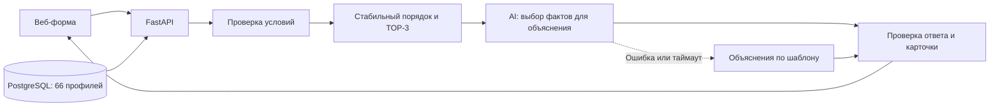

# HackAlem AI: план разработки MVP за 5 часов

**Команда:** pop-Eyes Team, 3 участника.

**Кейс:** умный подбор подрядчиков (#79-lite).

**Дата подготовки:** 23 сентября 2026 года.

**Рекомендация: FastAPI + PostgreSQL + простой веб-интерфейс, запускаемый через Docker Compose.** Фильтрацию и порядок карточек вычисляет код; AI помогает сформировать конкретные объяснения. Основной сценарий должен работать к концу второго часа.

План основан на предоставленных ТЗ, CSV и HTML-превью. Требования кейса рассматриваются как исходные материалы; распределение работы и приоритеты реализации — решения команды для пятичасового хакатона.

На момент подготовки плана приложение ещё не реализовано. Подготовлены [.env.example](../.env.example), [.gitignore](../.gitignore), [.dockerignore](../.dockerignore) и [проверка датасета с контрольными запросами](DATA_AUDIT.md). Указанные ниже результаты часов — цели, а не утверждение о выполненной работе. Тексты отчётов организаторам использовать только после достижения соответствующего checkpoint.

## 1. Краткое понимание задачи

Нужно помочь заказчику **выбрать подрядчика из существующего каталога**: принять условия мероприятия и вернуть **не более трёх подходящих карточек с содержательными объяснениями**.

Полный сценарий:

**Город, дата, формат, категория, бюджет, необязательные язык и длительность → проверка ограничений → стабильное ранжирование → объяснения → карточки либо понятная причина отсутствия результата.**

По фактическому CSV:

| Что проверено | Результат |
| --- | --- |
| Профили | 66, все ID уникальны |
| География | Алматы — 50, Астана — 15, «Зарубежье» — 1 |
| Категории | 17; у профиля может быть несколько |
| Синтетические профили | 13 |
| Подставленные значения | Город — у 8 профилей, цена — у 18 |
| Календарное окно | 23.09.2026–31.12.2026 |
| `max_hours` отсутствует | У флористов, декораторов, подарков/сувениров |

Критические особенности:

- `price_from_kzt` — **начальная цена**, нельзя обещать окончательную стоимость.
- `max_hours=null` означает неприменимость ограничения присутствия, а не ноль часов.
- За пределами календарного окна доступность неизвестна.
- Занятость площадок проверяется так же, как занятость ведущих и фотографов.
- В декабре мало свободных кандидатов — это ожидаемый результат.

## 2. Что жюри будет оценивать

В ТЗ указаны следующие критерии:

| Критерий | Баллы | Чем подтверждаем |
| --- | ---: | --- |
| Соответствие задаче и работоспособность | 25 | Полный сценарий, ограничения, три различимых исхода |
| Техническая реализация | 25 | Понятный алгоритм, работающая интеграция AI, устойчивость |
| README и воспроизводимость | 25 | Запуск с нуля, Docker, данные, инструкция проверки |
| Ценность и применимость | 15 | Объяснения помогают выбрать между кандидатами |
| Потенциал развития и оригинальность | 10 | Обоснованные улучшения и прозрачность рекомендаций |
| **Итого** | **100** | |

**Приоритет из ТЗ: объяснения → честная обработка редких, занятых и пустых категорий → скорость → интерфейс.**

Вероятные проверки жюри:

1. Повторить запрос и сравнить порядок карточек.
2. Изменить дату и проверить занятость.
3. Выбрать редкую категорию.
4. Указать слишком маленький бюджет.
5. Запросить категорию, которой нет в выбранном городе.
6. Сравнить объяснения: отличаются ли они содержательно после удаления имён.
7. Запустить проект по README.

## 3. P0 / P1 / P2

### P0 — обязательно для сдачи

- Форма: город, дата, формат мероприятия, категория, бюджет; язык и длительность необязательны для заполнения.
- Правильная загрузка предоставленного датасета.
- Проверка города, категории, даты, бюджета, формата и заданных дополнительных условий.
- Занятые подрядчики никогда не попадают в рекомендации.
- До трёх карточек: имя, категория, город, цена «от», 1–2 конкретных предложения.
- Одинаковый запрос на одной версии данных даёт одинаковый порядок.
- Три понятных исхода:
  - `matched` — подобрали;
  - `category_absent` — в этом городе нет такой категории;
  - `no_matches` — категория есть, но условия никто не проходит.
- Если найдено меньше трёх — показать фактическое количество и причину.
- Понятные ошибки ввода; даты вне известного календаря не считаются свободными.
- Рабочий резервный способ объяснений при недоступности AI.
- Проверка трёх обязательных демонстрационных сценариев из ТЗ.
- README, GitHub, отсутствие секретов.

**Дополнительные P0 нашей команды:** запуск приложения вместе с БД через Compose и демонстрация хотя бы одного настоящего вызова AI. Само ТЗ не предписывает конкретного провайдера.

### P1 — существенно повышает качество

- Отличительные факты из описания каждого подрядчика.
- Метки синтетических профилей и подставленных значений.
- Сводка причин исключения кандидатов.
- Кэш объяснений.
- Автоматические проверки бизнес-правил.
- Кнопки готовых демонстрационных запросов.
- Измерение времени ответа.

### P2 — только после стабильных P0 и P1

- Подсказка ближайшей подходящей даты.
- Поле дополнительных пожеланий и семантический поиск.
- Более подробное сравнение кандидатов.
- Публичный deployment.
- Дополнительные синтетические профили с явной маркировкой.

Отдельного списка обязательных bonus-функций в ТЗ нет — это наши варианты развития.

**В пять часов не закладываем:** бронирование, оплату, кабинеты, уведомления, обучение модели, сложную агентную систему и отдельную векторную БД.

## 4. Архитектура MVP



### Технологии

| Компонент | Решение |
| --- | --- |
| Интерфейс | HTML/CSS/JavaScript, одна страница |
| Backend | Python, FastAPI, Pydantic |
| База | PostgreSQL, простая таблица профилей |
| Импорт | Стандартный CSV-парсер |
| AI | OpenAI API, модель через `OPENAI_MODEL` |
| Проверки | pytest |
| Запуск | Docker Compose: `app` и `db` |

FastAPI может отдавать статические файлы интерфейса, поэтому отдельный frontend-сервер для такого MVP не нужен. [Документация FastAPI](https://fastapi.tiangolo.com/tutorial/static-files/)

### Бизнес-логика

1. Проверить ввод.
2. Найти профили по **городу + категории**.
3. Если их нет — вернуть `category_absent`.
4. Исключить занятых и не проходящих остальные условия.
5. Если никого не осталось — вернуть `no_matches`.
6. Отсортировать и взять первые три.
7. Подготовить объяснения.

**Базовое ранжирование:** начальная цена по возрастанию, затем `id` по возрастанию. Это прозрачная политика экономии бюджета; она не означает, что самый дешёвый подрядчик качественнее остальных. Для данного ТЗ сложный скоринг уступает по приоритету качеству объяснений.

Счётчики исключений считаем последовательно: **дата → бюджет → формат → длительность → язык**. Один профиль учитывается один раз, поэтому суммы не вводят пользователя в заблуждение.

### Что делает AI

Для первого прототипа используем `gpt-4o-mini`, если модель доступна командному аккаунту. Конкретную модель подтверждаем реальным запросом в первый час.

Надёжный вариант:

- Разбить описания на фрагменты с идентификаторами.
- Передать модели условия заказа и факты только трёх выбранных кандидатов.
- Попросить выбрать наиболее полезные отличительные фрагменты.
- Проверить, что возвращённые идентификаторы действительно принадлежат кандидатам.
- Собрать объяснение из проверенных условий и выбранного факта.

Модель не меняет цену, доступность, список кандидатов или их порядок. Structured Outputs помогает соблюдать формат ответа, но фактическую корректность всё равно нужно проверять. [OpenAI Docs](https://developers.openai.com/api/docs/guides/structured-outputs)

Пример объяснения на основе реального профиля:

> На 10 октября свободен по календарю, работает на корпоративах; цена от 500 000 ₸ при бюджете 1 000 000 ₸. В описании указана специализация на корпоративных мероприятиях и деловых встречах.

Для другого кандидата отличительным фактом может быть акцент на развлечениях и танцах без длинных речей.

**Ограничение времени:** один AI-запрос на все карточки, общий таймаут около 5 секунд, без длинных повторных попыток. При ошибке — конкретные объяснения по шаблону. Для пустого результата AI вообще не нужен.

NVIDIA API подключаем только при уже проверенном доступе и необходимости замены провайдера. Две интеграции одновременно не планируем.

### Docker и база

- `app`: API и веб-интерфейс.
- `db`: PostgreSQL с именованным томом.
- Автоматический импорт 66 профилей без дубликатов при повторном запуске.
- Проверка готовности БД перед запуском приложения.
- Секреты передаются через окружение.

В Compose для ожидания готовности БД нужен `healthcheck` и зависимость `service_healthy`. [Документация Docker](https://docs.docker.com/compose/how-tos/startup-order/)

**Целевой запуск после реализации:**

```powershell
Copy-Item .env.example .env
# Задать локальный пароль БД; при необходимости добавить API-ключ.
docker compose up --build
```

На момент подготовки плана проверка в текущем окружении не смогла подключиться к Docker Engine. Его работоспособность нужно подтвердить в начале первого часа.

## 5. Распределение ролей

| Участник | Ответственность | Владение файлами |
| --- | --- | --- |
| **1 — Backend / Integration** | API, БД, фильтры, ранжирование, Docker, финальная интеграция | Backend, схемы API, зависимости, Compose |
| **2 — AI / Data** | Разбор CSV, проверка данных, объяснения, AI, fallback | Импорт, AI-модуль, тестовые данные и проверки объяснений |
| **3 — Frontend / Demo** | Форма, карточки, состояния интерфейса, demo, README | Статический интерфейс и документация |

**Участник 1 — единственный ответственный за финальную интеграцию.** Изменения общего API и зависимостей согласуются через него.

## 6. План на 5 часов

Первые четыре часа: примерно **45 минут разработки, 10 минут интеграции и проверки, 5 минут отчёта**. Интегрировать можно и раньше.

### Час 1 — Foundation

Первые 10 минут вместе: утвердить API, структуру проекта, правила фильтрации и владельцев файлов.

| Участник | Задача | Результат |
| --- | --- | --- |
| 1 | FastAPI, `/health`, схемы API, Compose с PostgreSQL, минимальный импорт | Приложение и БД запускаются; API читает реальные профили |
| 2 | Разобрать CSV, проверить типы и флаги; сделать AI-вызов на реальных кандидатах и шаблонный fallback | Работающий прототип объяснений |
| 3 | Форма, карточки, три бизнес-состояния по согласованному JSON; каркас README | Интерфейс открывается и готов к подключению API |

**Checkpoint:** есть запускаемый каркас, реальные данные и минимальный AI-прототип.

**Demo организаторам:** показать интерфейс, `/health`, количество профилей и объяснение для реального кандидата.

**Что говорим:**

> Мы проверили все 66 профилей и зафиксировали правила обработки дат, бюджета и длительности. Подготовили API и интерфейс, проверили генерацию объяснений на реальных данных. В следующем часу соединяем полный сценарий подбора.

**Если Docker не заработал за 20 минут:** продолжить разработку на локальном Python с CSV в памяти; участник 1 возвращается к Compose после запуска основного сценария. Это временная мера.

### Час 2 — Core functionality

| Участник | Задача | Результат |
| --- | --- | --- |
| 1 | Все фильтры, три исхода, стабильный TOP-3, причины исключений | Рабочий `/api/recommendations` |
| 2 | Подключить объяснения к выбранным кандидатам, добавить проверку ответа и таймаут | AI-модуль можно вызывать из backend |
| 3 | Подключить форму к настоящему API; показать загрузку, ошибки и пустые результаты | Первый полный пользовательский сценарий |

**Checkpoint:** пользователь вводит параметры и получает реальные карточки. Даже при сбое AI выдача работает через fallback.

**Demo организаторам:** подбор ведущего в Алматы на 10 октября, повтор того же запроса, затем маленький бюджет.

**Что говорим:**

> Основной сценарий уже работает от формы до результата. Backend проверяет ограничения и возвращает стабильный порядок карточек. При отсутствии подходящих кандидатов пользователь получает причину, а сбой AI не ломает подбор.

### Час 3 — End-to-End integration

| Участник | Задача | Результат |
| --- | --- | --- |
| 1 | Проверить площадки, язык, длительность, границы календаря; закрепить запуск с БД | Все обязательные ветки работают через общий API |
| 2 | Улучшить отличительные факты; проверить цены, флаги и отсутствие выдуманных свойств | Объяснения содержательно различаются |
| 3 | Добавить метки данных, причины сокращения выдачи, готовые demo-запросы | Полный сценарий удобно демонстрировать |

**Checkpoint:** все P0-функции реализованы и соединены. Остаток времени — качество и проверка.

**Demo организаторам:** две даты одного запроса, флорист, отсутствующая категория, банкетный зал.

**Что говорим:**

> Обязательные сценарии соединены в одном приложении. Изменение даты меняет доступных подрядчиков, редкие категории не дополняются неподходящими профилями. Различаем отсутствие категории и отсутствие кандидатов по условиям.

### Час 4 — Feature completion + Testing

| Участник | Задача | Результат |
| --- | --- | --- |
| 1 | Проверки фильтров, порядка, повторного импорта и запуска; исправить ошибки | Бизнес-правила подтверждены проверками |
| 2 | Проверить AI-ошибки, fallback, качество объяснений; добавить кэш при необходимости | Предсказуемое поведение при недоступности API |
| 3 | Пройти сценарий жюри, измерить ответы, дописать запуск и ограничения в README | Готовая инструкция проверки и сценарий demo |

**Checkpoint:** все P0 проходят; на контрольных запросах ответ укладывается в ориентир до 10 секунд.

**Demo организаторам:** один обычный запрос, один пустой, работа с отключённым AI.

**Что говорим:**

> Проверили основные сценарии, повторяемость и поведение при недоступном AI. Сейчас завершаем документацию и проверяем воспроизводимый запуск. Новые функции добавляем только при отсутствии незакрытых обязательных требований.

**Решение на отметке 3:30:** если P0 нестабилен — убрать все P2. Deployment пробовать только при готовом приложении и знакомой платформе.

### Час 5 — Finalization + Demo + Submission

| Участник | Задача | Результат |
| --- | --- | --- |
| 1 | Финальные исправления, интеграция, проверка секретов, push | Проверенная версия в GitHub |
| 2 | Независимый запуск из свежего клона с новой БД; проверка контрольных запросов | Подтверждён запуск по README |
| 3 | Финальная сверка README, репетиция demo, проверка ссылки при deployment | Материалы готовы для жюри |

**Распределение последнего часа:**

- **4:00–4:20:** только исправления и финальные слияния.
- **4:20–4:40:** запуск из свежего клона; README проверяется буквально.
- **4:40–4:50:** финальный push и проверка опубликованного коммита.
- **4:50–5:00:** репетиция и резерв на сдачу.

**Checkpoint:** GitHub содержит ту же версию, которую команда демонстрирует.

**Demo организаторам:** короткий законченный сценарий с повторным запросом и пустым результатом.

**Что говорим:**

> Финальная версия отправлена в GitHub и проверена запуском из свежего клона. README описывает реальные возможности и ограничения. Мы готовы показать подбор, изменение доступности по датам и корректный пустой результат.

## 7. Интеграция компонентов

### API фиксируем в первые 10 минут

Минимальные endpoints:

| Endpoint | Назначение |
| --- | --- |
| `GET /health` | Готовность приложения и данных |
| `GET /api/options` | Города, категории, форматы, языки, календарное окно |
| `POST /api/recommendations` | Подбор |

Пример запроса:

```json
{
  "city": "Алматы",
  "date": "2026-10-10",
  "event_type": "корпоратив",
  "category": "Ведущий",
  "budget_kzt": 1000000,
  "duration_hours": null,
  "language": null
}
```

Обязательные поля ответа:

- `status`, `message`;
- `cards`;
- `total_in_city_category`, `eligible_count`;
- `excluded_counts`;
- `explanation_mode`;
- `dataset_version`.

Карточка содержит `id`, имя, категории, город, начальную цену, объяснение и флаги происхождения данных.

Ошибки ввода возвращаются отдельно от трёх бизнес-исходов.

### Точки соединения

- **Первый час:** frontend использует согласованные примеры ответов; AI-модуль принимает тот же объект запроса.
- **Второй час:** настоящие данные и фильтры подключены к интерфейсу.
- **Третий час:** AI и все крайние случаи работают в общем приложении.
- **Четвёртый час:** контракт заморожен, исправляем ошибки.

Кэш объяснений привязывается к нормализованному запросу, версии датасета, модели и prompt. **Порядок карточек от кэша и AI не зависит.**

## 8. Git/GitHub стратегия

Используем `main` и три рабочие ветки:

- `codex/backend`
- `codex/ai-data`
- `codex/frontend`

Правила:

1. `main` всегда должен запускаться.
2. Commit — после законченного изменения, ориентировочно каждые 20–30 минут.
3. Merge — небольшими порциями, обязательно в конце каждого часа.
4. Перед следующей порцией работы синхронизировать свою ветку с `main`.
5. Общие схемы, зависимости и Compose меняет участник 1.
6. README ведёт участник 3, остальные передают ему проверенные команды и ограничения.
7. Финальную интеграцию и push выполняет участник 1.

Подготовленная `.gitignore` исключает `.env` и `.env.*`, сохраняя `.env.example`. `.dockerignore` исключает секреты из контекста сборки. API-ключ используется только сервером.

Если ключ случайно попал в Git, одного удаления файла недостаточно: ключ нужно отозвать и заменить.

**README собираем с первого часа. К сдаче он должен содержать:**

- Название, проблему и целевого пользователя.
- Реально реализованные функции и пользовательский сценарий.
- Технологии, модель/API и режим без ключа.
- Архитектуру и правила ранжирования.
- Запуск через Docker и настройку окружения.
- Происхождение данных, смысл флагов и календарное окно.
- Контрольные запросы для жюри.
- Известные ограничения.
- Рабочую deployed-ссылку, только если deployment действительно выполнен.

## 9. Риски и fallback

Оценки вероятности ниже — планировочные.

| Риск | Вероятность | Влияние | Решение / fallback |
| --- | --- | --- | --- |
| AI API недоступен или нет доступа к модели | Средняя | Высокое для объяснений | Реальный вызов в час 1; шаблоны из проверенных данных |
| AI придумывает свойства | Средняя | Высокое | Выбор разрешённых фактов, проверка ID, фактические поля формирует код |
| Ответ превышает 10 секунд | Средняя | Высокое | Один вызов, короткий ответ, таймаут 5 секунд, fallback |
| Docker Engine недоступен | Уже есть препятствие при проверке | Высокое для запуска | Проверить в начале; временно разрабатывать на Python, завершить Compose до финального часа |
| Deployment затягивается | Средняя | Среднее | Лимит 20 минут; сдача с воспроизводимым локальным запуском |
| Frontend и backend расходятся | Средняя | Высокое | Контракт сразу, подключение во второй час |
| CSV разобран неверно | Средняя | Высокое | CSV-парсер, явные типы, проверка 66 ID |
| Зависимость от работы другого участника | Средняя | Высокое | Примеры ответов и интерфейсы функций в час 1 |
| Merge-конфликты | Средняя | Среднее | Владение файлами, частые небольшие слияния |
| Не хватает времени | Высокая | Высокое | Отказ от P2; после четвёртого часа только исправления |

**Очередность сокращения объёма:** deployment → дополнительные пожелания → альтернативные даты → визуальная полировка. Фильтры, честные пустые состояния, объяснения и README сохраняем.

## 10. Definition of Done

Проект готов, когда жюри может:

**Открыть приложение → ввести условия → отправить запрос → получить до трёх допустимых кандидатов с конкретными объяснениями либо понятный пустой результат.**

Дополнительно подтверждено:

- Занятые и не соответствующие обязательным условиям кандидаты исключены.
- Повторные запросы дают одинаковый порядок, в том числе после перезапуска.
- Изменение даты учитывает календарь и отражается в объяснениях.
- Объяснения содержат отличительные факты.
- Язык и длительность учитываются, если заданы.
- `max_hours=null` обрабатывается правильно.
- Нет скрытого расширения бюджета, города или даты.
- Отсутствие AI не ломает основной сценарий.
- Контрольные ответы приходят в пределах ориентира до 10 секунд.
- Проект запускается из свежего клона по README.

### Проверенные сценарии для жюри

Во всех строках формат — **корпоратив**, язык и длительность не заданы. Это расчёт по исходному CSV, ещё не тест готового приложения.

| Сценарий | Ввод | Ожидаемый результат |
| --- | --- | --- |
| Плотная категория | Алматы, Ведущий, 10.10.2026, 1 млн ₸ | Проходят 4; показать 3 |
| Смена осенней даты | Тот же запрос, 14.11.2026 | Проходят 4, состав TOP-3 меняется |
| Сезонная занятость | Тот же запрос, 19.12.2026 | Один кандидат — Кики; 9 из 10 заняты |
| Редкая категория | Алматы, Флорист, 10.10.2026, 500 тыс. ₸ | Один — Тони Тони Чоппер |
| Никто не проходит | Алматы, Ведущий, 10.10.2026, 10 тыс. ₸ | `no_matches` |
| Категории нет | Астана, Декоратор, 10.10.2026, 1 млн ₸ | `category_absent` |
| Площадка | Алматы, Банкетный зал, 14.11.2026, 6 млн ₸ | Два подходящих зала |

Для первого запроса при предложенном порядке ожидаются: **Куррапика → Аня Форджер → Сон Гоку**.

Ожидаемые ID и дополнительные замечания находятся в [DATA_AUDIT.md](DATA_AUDIT.md). При изменении данных или политики ранжирования контрольные результаты нужно пересчитать.

## 11. Checklist перед сдачей

- [ ] Все P0 выполнены.
- [ ] Основной сценарий работает end-to-end.
- [ ] Показаны плотная, редкая и пустая категории.
- [ ] Два разных пустых исхода различимы.
- [ ] Проверены повтор запроса и изменение даты.
- [ ] Площадки проходят те же проверки занятости.
- [ ] Объяснения конкретны и подтверждаются данными.
- [ ] Проверены язык, длительность и `null`.
- [ ] Подписаны цена «от» и происхождение данных.
- [ ] Проверены AI-ошибка и fallback.
- [ ] Проверено время ответа.
- [ ] Приложение и БД запускаются через Docker Compose.
- [ ] Нет API-ключей в файлах и истории GitHub.
- [ ] `.env` находится в `.gitignore`.
- [ ] Есть `.env.example`.
- [ ] Проект запускается по README из свежего клона.
- [ ] README соответствует реальному проекту.
- [ ] Есть инструкция проверки для жюри.
- [ ] Выполнен финальный GitHub push.
- [ ] Проверена последняя версия репозитория.
- [ ] Подготовлено короткое demo.
- [ ] Если есть deployment — ссылка работает.

Для последующих отчётов достаточно присылать: **сколько времени осталось; что сделал каждый участник; что работает end-to-end; какие есть блокеры**. По отчёту пересматриваем план оставшегося времени, приоритеты и распределение задач между участниками.
